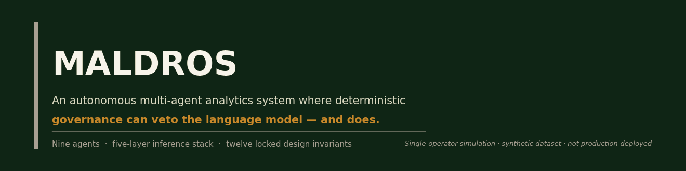
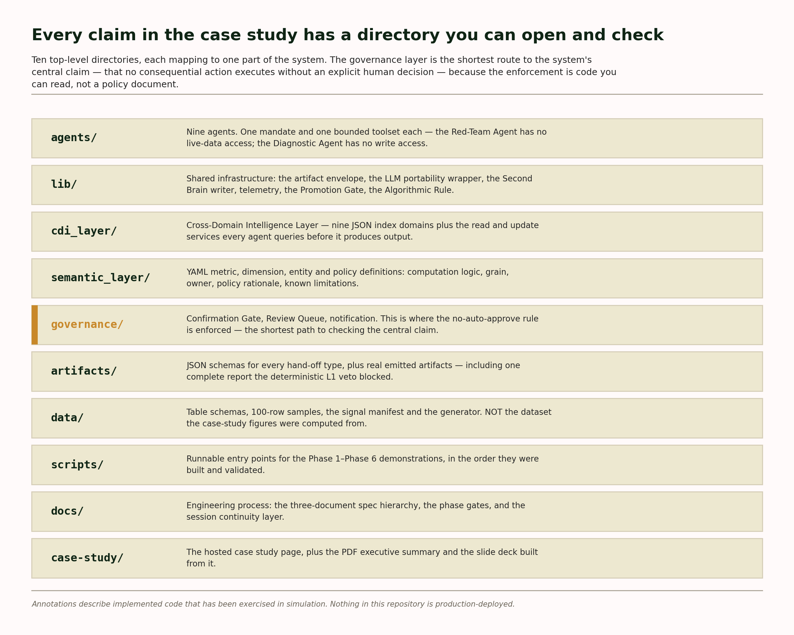

-0F2515?style=flat-square)


---

## What this is

**Maldros is a multi-agent system that carries an analytical investigation from an initial business question through to a validated, evidence-backed briefing, and that blocks the release of its own findings when they fail a governance check.**

Nine agents do the work, each with a single job and a fixed set of tools: decomposing the question, querying the data, running and validating the statistics, adversarially stress-testing the finding, then writing it up in both a technical and a plain-language layer. What makes it unusual is the governance. A layer of ordinary deterministic code sits above the language model and holds a veto over it, and the model has no path to overrule that.

Two layers underneath make the rest possible. A semantic layer holds every metric, dimension and entity as a versioned definition carrying its computation logic, its grain, and the policy reasoning behind it, so a number means the same thing to every agent that touches it. An institutional memory layer records each investigation, correction and governance decision as a linked note, with a vault write required alongside every artifact rather than left to anyone's discipline.

The domain it was built and tested against is fraud, abuse and policy analytics at an AI platform. It is design-complete and validated in simulation against a synthetic dataset. It is not deployed. This repository is the evidence: the agent implementations, the artifact schemas, the governance code, and recorded runs including one the governance stopped.

---

## Industry-wide constraints I'm trying to solve and insights

When I started this, my question wasn't which attacks were happening. It was what the digital and physical fraud and defense ecosystem looks like if you step back far enough to see the structure instead of the incidents. What is actually going on underneath.

The answer I kept arriving at was attribution, not detection. Detection gets most of the industry's attention and is solved well enough to be a poor place to compete. What large AI firms and AI deployment companies lack is mature attribution structure: the ability to say which activity was abusive, which cost it caused, which control failed, and on what evidence. A bank has spent decades building that. An AI platform generating billions of interactions a day mostly has not, and the absence propagates outward. Without attribution you cannot target a countermeasure, so you apply population-wide friction that penalises the customers you least want to lose. You cannot size the exposure, so you cannot price it, insure it, or report it credibly. And you cannot demonstrate the care you took, which is the question that arises after something has gone wrong rather than before. Regulatory bodies have been unforgiving of product negligence.
Furthermore, AI firms face hundreds of thousands of fraud and scam attacks at machine speed, traditional security systems demonstrate a lack of capacity to adequately safeguard critical infrastructure and assets. In practice, one of the main objectives of building Maldros was to establish a progressive architectural foundation for developing increasingly advanced and capable policy and fraud analysis platforms.

What the research kept surfacing were problems the industry has not solved, rather than problems particular to any one team.

**No structural guarantee.** Agentic systems stall before consequential work because nothing in them prevents a wrong answer from reaching a person looking exactly like a right one. Confidence scoring is the usual answer, and it is a suggestion rather than a control. Maldros replaces it with deterministic checks holding a veto the model cannot overrule, so a draft that fails one does not exist as output rather than existing with a warning attached to it.

**Review capacity as the ceiling.** Where such a system does get deployed, the person checking its output becomes the limit on its throughput, and a reviewer facing a queue of mostly routine items stops reading carefully, so the review is nominally happening and actually is not. Maldros routes automatically: routine operational events go to a log, and sign-off is reserved for novel findings, architectural changes and ship decisions. In the Phase 6 run it routed 175 artifacts correctly with no human involvement at any intermediate step.

**Metric drift.** Definitions diverge between teams until every cross-functional finding becomes an argument about whose number is right, and that argument happens before anyone can act on the finding. Maldros holds every metric, dimension and entity in a versioned semantic layer carrying its computation logic, its grain and the reasoning behind the policy choice, so a number means the same thing to every agent that touches it and the definition is auditable rather than folkloric.

**Unvalidated interventions.** Countermeasures and product changes ship on tests nobody checked for sample ratio mismatch or novelty effects, so the organisation learns the wrong lesson and repeats it. Maldros requires a statistician to clear a finding before it can be written up. In a blind run of three experiments it returned no-ship on one after detecting a sample ratio mismatch, hold on a second after a novelty effect, and ship on the third, without being told which carried which flaw.

**Knowledge that doesn't compound.** The pattern recognition that makes a good fraud analyst takes years to build and leaves with them, and a standard stack retains the query but not the reasoning behind it. Maldros requires a vault write alongside every artifact rather than leaving documentation to anyone's discipline, and records each investigation, correction and governance decision as a linked note, so the reason a decision was made survives the person who made it.

Inside a fraud or policy analytics team the same gap shows up as several separate frustrations that are really one problem. Coordinated abuse hides from per-account monitoring, because every account in a ring looks ordinary and only the relationship between them does not. Enforcement gets softened because the evidence behind it will not survive a challenge from the customer, from legal, or from a regulator. Analyst attention goes to triage and formatting rather than judgment. And when a pipeline degrades quietly, every decision downstream is made on bad inputs and nobody finds out for weeks.

Maldros is an attempt to build the attribution layer rather than another detector. Every finding traces back to the query that produced it. Every hand-off between agents is sealed and carries its provenance. Every governance decision is logged with its reason. That is what makes an enforcement action defensible and a loss attributable to something you can act on, and it is why the Phase 1 investigation surfaced a coordinated cluster of 41 accounts inside a population whose overall rate was flat.

What exists today is a single-operator build against synthetic data. The directions I think would extend furthest with a real team behind them are cyber-physical systems, where a model's output becomes something that moves and mistakes stop being recoverable; attribution that works across providers rather than one platform at a time, since adversaries already iterate across all of them; and closing the gap between investigation cycles and the speed at which coordinated abuse actually adapts.

---

## The finding

**A deterministic rule layer that can overrule the language model is the difference between an agent system that produces output and one you can put in front of a regulator.** Maldros implements that layer and then proves it fires. During Phase 1 development the L1 gate blocked 14 of 18 Storyteller runs; the report could not ship until it was rebuilt to satisfy all three vetoes. One of those blocked drafts is included in this repository — complete on all eighteen required assets, zero missing — still carrying its `BLOCKED` status.

Most agent demos show you the run that worked. This repository ships the run that didn't, on purpose.

**Impact.** Autonomy is cheap to demonstrate and expensive to trust. The engineering problem is not getting agents to produce an answer — it is guaranteeing that an answer which fails a correctness rule cannot reach a human as though it passed. Most systems score their own confidence and leave a person downstream to catch what slipped through; these checks prevent the error rather than flag it, because a draft that fails one does not exist as a shippable output. That distinction matters most where the model's own judgement is the last line of defence, because then that judgement is the attack surface: you do not have to defeat the rule, you only have to talk the model into setting it aside. A regex has nothing to persuade — and it does not vary with fatigue, deadline, or day of the week.

> **Scope, stated plainly.** This is a single-operator simulation run against a synthetic dataset, built and executed through scripted Python. It is **design-complete** and **validated via simulation**. Nothing here is production-deployed, wired to live data, or serving real users. Where this README describes a capability, it names which of those two states it is in. See [Limitations](#limitations).

**Start here:** the [full case study](https://l-mota.github.io/maldros-analytics-system/case-study/) — the long-form artifact this repository is the evidence for.

---

## The numbers

Every figure below is a measured result from a recorded run against the synthetic dataset. None is a projection, and none is production traffic.

| Metric | Value | What it means, and what it doesn't |
|---|---|---|
| End-to-end investigation runtime | **288.9 s** | Full Orchestrator → Analyst → Statistician → Storyteller chain, question to written report, no human step in between. Validated via simulation. |
| Citation coverage on the report that was **blocked** | **97.2%** | 104 of 107 factual claims traced to a source, and the omission audit clean — blocked anyway, by a different veto entirely. The three checks are independent; clearing two is not a pass. |
| Citation coverage on the report that **shipped** | **94.6%** | 88 of 93 claims sourced, all three vetoes cleared — Discovery Report `84c4e728`, the run that AIMS Mode B briefing `41954983` derives from. |
| Coordinated-cluster concentration | **16.54×** | 41 accounts abusing at 16.54× the non-cluster rate — while the Q1 population-level rate was **0.946×** the non-Q1 average. Concentration, not a volume spike. |
| Q1 financial exposure attributed to API abuse | **$5.89M** | Across US + EU in the synthetic model. A modelled figure over synthetic data, not a real loss. |
| Artifacts audited under full AIMS | **175** | 100% correct Mode A / Mode B routing, an 89 / 86 split, no human scaffolding at any intermediate step. |
| Injected pipeline failures detected and repaired | **3 of 3** | Structural break, gradual degradation, cascade — each classified and remediated using strategies drawn from five analogue disciplines. |
| Blind experiment verdicts | **3 of 3 correct** | NO_SHIP (sample ratio mismatch), HOLD_FOR_HARDENING (brittle design + novelty effect), SHIP. The system was not told which experiment carried which pathology. |
| Phase 6 demo wall-clock | **73.6 s** | `scripts/phase6/run_phase6_demo.py`, complete run. |

**Recommendation for a reader with five minutes:** ignore the runtime. It is the least interesting number here. The one that matters is the 97.2% row: a report sourced that thoroughly, stopped dead anyway. A gate that only fires on obviously bad output is not a gate, and that pairing is what separates this from a faster, less careful build.

---

## What the governance actually looks like in code

Four claims, each followed immediately by the source that proves it. These are excerpts; the full files are in the tree.

### Claim 1 — Three deterministic vetoes can block a finished report, and the LLM cannot override them

The Storyteller Agent produces the human-facing output. Before anything ships, three non-LLM checks run — and each is cruder than the phrase "AI guardrail" tends to suggest, which is the point of them.

- **The causal-language veto** is a twelve-term banned-phrase list — "caused by", "drove", "led to", "due to", "responsible for" and seven others — matched by word-boundary regex, carrying an exemption list so that methodology language such as *"underpowered due to small sample size"* reads as a statement about a test rather than a causal claim about the data.
- **The citation check** is a footnote-marker scan. It segments the stakeholder-facing section into factual sentences, looks for a `[^N]` marker in proximity to each, and excludes meta-fields from the denominator.
- **The omission audit** compares the output against a fixed set of material findings derived from the upstream artifacts — the primary conclusion, the statistical verdict, the cluster finding, the financial impact — not against a tunable materiality score.

None of the three consults a language model, and none of them can be argued with. Failure of any one is terminal for that draft. The analogy that fits is a car whose brakes are wired to the radar rather than to the driver: the onboard intelligence may be entirely convinced the wall is not there, and the brakes engage regardless.

```python
# agents/storyteller/storyteller.py
l1_passed = (
    causal_check["passed"] and citation_check["passed"]
    and omission_check["passed"] and c020_check["passed"]
    and readiness_check["passed"]
)
blocked = not l1_passed

if blocked:
    print(f"[Storyteller] OUTPUT BLOCKED by L1/C-020 veto(s)")
    # Vetoes block the report — still write the artifact with BLOCKED status
    # so the Diagnostic Agent can observe the failure
```

The comment on the last line is the design decision worth noticing: a blocked report is still written to the artifact store. Failures are observable, not discarded.

**The evidence:** [`artifacts/examples/aims_mode_b_blocked.example.json`](artifacts/examples/aims_mode_b_blocked.example.json) is a real Mode B artifact from a Phase 1 run. All eighteen required assets present, zero missing, citation check passed, omission check passed — and one veto failed:

```json
"l1_compliance_summary": {
  "overall_passed": false,
  "causal_check": false,
  "citation_check": true,
  "omission_check": true,
  "c020_executive_layer": true,
  "c020_readiness_checklist": true
},
"status": "BLOCKED"
```

That artifact is one of the blocked drafts from Phase 1 development. The most instructive of them is a different one: it reached **97.2% citation coverage — 104 of 107 claims sourced — and passed the omission audit. It was blocked anyway.** The causal-language veto found a single instance of the phrase "due to" and stopped the report from shipping. The three vetoes are independent and each is individually fatal; clearing two is not a pass. *(That run is recorded in the Phase 1 investigation log. The blocked artifact shipped here is a different draft from the same arc, included because it is the one with all eighteen assets complete.)*

A finished report killed by a single deterministic check is a stronger demonstration of the gate than any report that passed. The passing counterpart is shipped beside it at [`aims_mode_b.example.json`](artifacts/examples/aims_mode_b.example.json) for comparison.

### Claim 2 — No consequential action can be auto-approved, including by timeout or operator absence

```python
# governance/confirmation_gate/confirmation_gate.py
#
# No auto-approve under any condition. Not on timeout. Not on operator absence.
# Silence ≠ approval. This rule is locked.

gate_item = {
    "artifact_id": artifact_id,
    "producing_agent": producing_agent,
    "trigger_reason": trigger_reason,
    "no_auto_approve": True,                    # Permanent. Cannot be changed.
    "requires_explicit_operator_decision": True,
}
```

The submission method has no approval path in it at all — it can only enqueue. During the Phase 6 run this gate intercepted a proposal the system had generated about itself — *"Minimum-N Guard with Exact-Method Substitution for Small Subgroup Statistical Analyses"*, addressing the Statistician's tendency to produce overconfident point estimates on small subgroups, and already carrying a passing sandbox verdict — and refused to act on it. The note written into the gate log reads, verbatim:

> Design Invariant #2: No auto-approve under any condition. This proposal does not deploy until the operator explicitly approves it. Silence ≠ approval. Timeout ≠ approval.

It is still marked `AWAITING_DECISION`. A system that generates a sound improvement to itself, verifies it, and then cannot install it is behaving correctly — that is the rule working, not a task stalling.

### Claim 3 — Every inter-agent hand-off is a typed, content-hashed, immutable artifact

There is no shared mutable state between agents. Each hand-off is a JSON envelope, written once, with a hash over its own content and an explicit provenance chain back to its inputs.

```python
# lib/artifact.py
return {
    "artifact_id": str(uuid.uuid4()),
    "artifact_type": artifact_type,
    "schema_version": "1.0.0",
    "phase_of_origin": phase,
    "producing_agent": producing_agent,
    "timestamp_utc": datetime.now(timezone.utc).isoformat(),
    "provenance": provenance or [],
    "content_hash": content_hash,
    "confidence_score": confidence_score,
    "known_limitations": known_limitations or [],
    "content": content,
}
```

`known_limitations` is a required field, not an optional one — an agent cannot hand off work without declaring what its work does not cover. Rewriting an artifact in place raises; corrections must create a new artifact naming the original in `provenance`. Schemas for all eight envelope types are in [`artifacts/schemas/`](artifacts/schemas/).

### Claim 4 — The system cannot skip its own exploration budget

A self-improving loop that only pursues promising leads converges on its own priors. Maldros reserves a fixed share of investigation cycles for counter-intuitive hypotheses pulled from an open register of unresolved questions. The percentage is analyst-adjustable within bounds; the mechanism is not skippable.

```python
# lib/algorithmic_rule.py
DEFAULT_EXPLORATION_PERCENT = 10.0
MIN_EXPLORATION_PERCENT     = 5.0    # analyst-floor; system cannot go below
MAX_EXPLORATION_PERCENT     = 50.0   # analyst-ceiling; system cannot go above

expected_explorations = (cycle_n * pct) / 100.0
fired_so_far          = state.get("exploration_cycles_fired", 0)
is_exploration        = expected_explorations - fired_so_far >= 1.0
```

The counter is persisted to disk, so the obligation survives process restarts. In the Phase 4 run it fired on schedule and surfaced a hypothesis the system would not otherwise have reached.

### Why this is the part worth building

The binding constraint on putting an autonomous system into a consequential domain is usually not capability — it is being able to demonstrate, afterwards and to someone unsympathetic, that reasonable care was exercised. Perfect prevention is not purchasable at any price and is the wrong target; a defensible evidentiary record is purchasable, and it is what an auditor, a regulator or an incident review actually asks to see. That inverts the usual ordering in which governance is overhead wrapped around the real work: here the immutable artifact chain, the provenance links, the logged non-activations and the blocked drafts kept rather than discarded *are* the deliverable, and the analysis is what populates them. Maldros was built on that assumption from the first phase rather than retrofitted with it afterwards, which is why the vetoes sit underneath the language model rather than beside it.

**Recommendation:** if you read only one file in this repository, read `governance/confirmation_gate/confirmation_gate.py`. It is short, and it is where the architecture's central claim is either true or false.

---

## How the repository is laid out

The directory structure is the architecture. Each top-level folder maps to a layer of the system rather than to a code-organisation convention, so the tree itself is readable as a design document.



| Path | What lives here |
|---|---|
| `agents/` | Nine agents, each a directory containing a `system_prompt.md` and its implementation. |
| `lib/` | Shared machinery: artifact envelope, LLM abstraction, Second Brain writer, telemetry, promotion gate, few-shot bank, algorithmic rule, design tokens. |
| `governance/` | Confirmation Gate, Review Queue, notification tiers, operator configuration. |
| `cdi_layer/` | Cross-Domain Intelligence Layer — the always-on index every agent queries before acting, plus the capability registry. |
| `semantic_layer/` | Metric, dimension, entity and policy definitions in YAML. Metrics carry computation logic, grain, owner, policy rationale and known limitations. |
| `artifacts/` | JSON schemas for all eight hand-off types, plus four real example artifacts including the blocked one. |
| `data/` | The dataset generator, a signal manifest, per-table schemas, and small row samples. |
| `scripts/` | Phase demo entry points and the AIMS report renderer. |
| `docs/` | Engineering-process write-up and figures. |
| `case-study/` | The hosted case study and its derivatives. |

### The nine agents

| Agent | Mandate |
|---|---|
| **Orchestrator** | Decomposes the question, queries the knowledge vault, emits a Capability Bundle as the first artifact of every task, routes to specialists. |
| **Data Architect** | Designs and validates data models and semantic-layer definitions. |
| **Analyst** | Hypotheses → query → Python execution → interpretation → recommendations. |
| **Statistician** | Validates every inference; experiment analysis; sample-ratio-mismatch and novelty-effect detection; ship / no-ship verdicts. |
| **Storyteller** | Dual-layer output — technical and plain-language. Translates; never derives. Renders its own charts. Subject to the three vetoes above. |
| **Diagnostic** | Continuous read-only monitoring on an L0–L4 escalation ladder. Deliberately has no write access. |
| **Healing** | Characterises a failure, retrieves repair strategies across five analogue disciplines, scores, applies, verifies. Drafts only — never merges to production. |
| **Red-Team** | Adversarial stress testing across twelve evasion categories. Returns Robust / Conditionally Robust / Brittle. No live-data access by design. |
| **Forge** | The invention engine. Operates all seven reasoning modes under an explicit novelty floor, and is required to survive Red-Team review *before* statistical validation rather than after. |

---

## Running it

```bash
git clone https://github.com/l-mota/maldros-analytics-system.git
cd maldros-analytics-system
pip install -r requirements.txt      # pandas, numpy, duckdb, scipy, networkx, matplotlib, anthropic
```

Phase demos live under `scripts/phase1/` … `scripts/phase6/` and resolve the repository root relative to their own location, so run them from the repository root.

**What will and will not work from a fresh clone.** The agent implementations require a language-model API key and the full artifact store to execute end to end; neither is included. `scripts/render_aims_report.py` — the canonical reference implementation of the visual design system, and the renderer that produced the report in `case-study/` — reads from an artifact directory that is not shipped, so it will exit with a not-found error rather than render. It is here to be read, not to be run. The code, the schemas, the semantic layer, the governance logic and the recorded outputs are all fully inspectable as they stand.

---

## Limitations

Stated because a reviewer will find them anyway, and finding them stated is the point.

- **The data is synthetic.** Seven tables generated by `data/generate_dataset.py` under a fixed seed, modelling eighteen months of AI-platform fraud and abuse analytics. It is analytically rich by design — coordinated clusters detectable by graph analysis but not by thresholds, gradual escalation detectable only sequentially, injected experiment pathologies — but it is not real company data and no conclusion here transfers to one.
- **`data/samples/` is not the dataset the case-study figures were computed from.** The samples are one-hundred-row extracts shipped so the schemas are legible. The figures in the case study were computed over the full generated tables — roughly 750,000 API events, ~2,000 accounts, 475 fraud incidents. Running an analysis against the samples will not reproduce them, and is not meant to.
- **No live operator interface.** A six-dashboard operator console exists as an approved design-system mockup at [`case-study/operator_ui_mockup.html`](https://l-mota.github.io/maldros-analytics-system/case-study/operator_ui_mockup.html). It is a design reference, not running software, and is not wired to data.
- **The Analyst Agent's query implementation is built around its demonstrated investigation.** It is not generalised to arbitrary free-text questions. Pointing it at a genuinely new question is future work, not a supported path.
- **One self-generated improvement proposal is currently blocked at the Confirmation Gate**, awaiting human sign-off. This is the no-auto-approve rule working exactly as specified, and it is listed here as a limitation only because the alternative — quietly approving it — would have been the actual defect.
- **Known architectural constraints, named in the system's own design documents.** Sequential script execution becomes a throughput bottleneck as agent count and cycle depth grow. DuckDB over Parquet stands in for the intended production warehouse; the migration path is designed but not exercised. This is a single-operator build with no multi-tenant or role-based access model.

- **The capability-multiplier figures are a design target, not a measurement.** What Phase 4 measured is edit distance, which declined across all three tracked query classes. The fifty-cycle `1.65×` / `11.5×` figures that appear in the design documents are a projection reasoned by cross-domain analogy — they were never measured, and they are labelled as projections at every point they appear in this repository. If you encounter any version of this project that presents them as a measured result, that version is wrong and this line supersedes it.

**Explicitly out of scope:** real-time streaming ingestion, live external API integration, multi-user access and role-based governance, production SLAs, and model retraining or fine-tuning.

**And one limit that is permanent rather than pending.** There is a constraint in the register I marked permanent and won't close: the system can produce proof and it cannot produce agreement. It can establish that an experiment shouldn't ship and write the case so it survives scrutiny, and it still can't sit across from the product manager whose quarter that decision wrecks and find a path they'll accept. Proof isn't persuasion, and no amount of governance rigour converts one into the other.

---

## Stack

Python (pandas, numpy, scipy, networkx, matplotlib) · DuckDB over Parquet for in-memory analytical queries · YAML semantic layer · JSON artifact store, content-hashed and immutable · an Obsidian markdown vault with explicit wiki-link relationships as the institutional knowledge layer · scripted orchestration with a wrapper class isolating the language-model call so the model is swappable. Ten notes ported verbatim from that vault — analyses, metrics, a dimension, agent records and a governance decision — are in [`second_brain_sample/`](second_brain_sample/), wiki-links preserved, with one traversal walked end to end in that folder's README.

Two components are specified and referenced by the shipped code but are **not** included in this repository: the vector-index retrieval path behind the knowledge vault (keyword retrieval is what the recorded runs used), and the production warehouse the DuckDB layer is designed to be swapped for. Both are named here rather than implied by omission.

---

## Further reading

| Document | For |
|---|---|
| [**Full case study**](https://l-mota.github.io/maldros-analytics-system/case-study/) | The complete argument, with interactive architecture and lifecycle diagrams. Start here. |
| [Executive summary (PDF)](case-study/maldros_executive_summary.pdf) | Two pages. Finding, KPIs, recommendation. |
| [Slide deck](https://raw.githubusercontent.com/l-mota/maldros-analytics-system/main/case-study/maldros_case_study_deck.pptx) | Eleven slides, one primary statement each. Downloads on click. |
| [AIMS Mode B report](https://l-mota.github.io/maldros-analytics-system/case-study/aims_mode_b_report.html) | A real generated output — the actual stakeholder briefing the pipeline produced, not a description of one. |
| [Engineering process](docs/engineering_process.md) | The build methodology: spec hierarchy, phase gates, the continuity layer, and a public-safe sample of the change log. |
| [Why this matters](docs/why-this-matters.md) | The longer argument for why auditable evidence of care, rather than raw capability, is becoming the binding constraint on deploying these systems. Reasoning, not results. |
| [Operator console mockup](https://l-mota.github.io/maldros-analytics-system/case-study/operator_ui_mockup.html) | Approved design reference. Not running software. |

---

## Contact

**Luis Mota** — [luissmota29@gmail.com](mailto:luissmota29@gmail.com)

Happy to walk through the architecture, the evidence behind any specific claim, or the build process itself. If something in this repository does not hold up under checking, that is worth an email too.

---

## License

All rights reserved. See [LICENSE](LICENSE). The source is published for review and evaluation only; no right to use, copy, modify, or redistribute is granted. Note that GitHub's Terms of Service independently grant every user the ability to view and fork any public repository, regardless of this file.

---

<sub>Maldros is a single-operator research and portfolio build. Design-complete and validated via simulation against a synthetic dataset. Not production-deployed.</sub>
