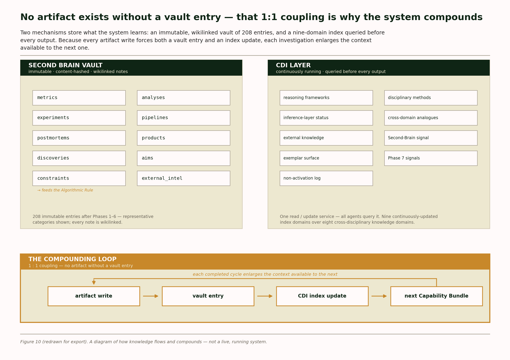

# The knowledge layer is a navigable graph, not a folder of logs

**Every artifact the agents produced wrote itself into a linked institutional memory — and you can walk that memory end to end, from a finding back to the agent that produced it, without reading a single line of code.** That is what this folder demonstrates. Ten notes, lifted verbatim from the working vault, with the wiki-links rewired so the walk actually clicks in a browser.

**Why it matters.** An agent system that writes results to disk has logs. An agent system that writes results into a graph has a memory it can query on the next task — which is the mechanism behind cross-task retrieval, the Few-Shot Bank, and the Constraint Register. The vault is the substrate all three sit on. If the links are decorative, the capability claims above them are decorative too. So the links are here to be checked.



*Figure — Knowledge architecture of the Second Brain vault. The conclusion this diagram supports is stated above it, per the project's visual design system; the diagram is evidence for that conclusion, not the introduction of a new one.*

---

## By the numbers

| Metric | Value | What it does *not* mean |
|---|---|---|
| Notes in this sample | **10** | Not a curated highlight reel — they were chosen because they form a connected walk, and two of them record failures. |
| Markdown notes in the working vault | **219** | Not 219 hand-written notes. The large majority are agent-generated run records; this sample is drawn from both generated and specification notes. |
| Vault folders represented | **5 of 10** | `analyses`, `metrics`, `dimensions`, `agents`, `governance`. Not represented here: `discoveries`, `aims`, `pipelines`, `constraints`, `external_intel`. |
| Hops in the guided traversal | **5** | Every hop is an edge that exists in the source vault. One hop had to be re-routed — documented below rather than hidden. |
| Notes carrying a one-line summary | **10 of 10** | Enforced by the vault writer under operator directive D-2, not added for presentation. |

---

## Walk the graph in five hops

Start at a finding. End at the agent that stress-tested a different finding, and see how the graph got you there. Each link below is live — click through and the trail holds.

**1 · The investigation** → [Analysis — Is the spike in API abuse volume in Q1](analyses/q1-api-abuse-investigation.md)

The Analyst Agent asks whether a Q1 abuse spike is coordinated or organic. It concludes `COORDINATED_ABUSE` — 41 accounts, 25.87% of Q1 abuse events. It also records that the spike it was sent to investigate does not exist (ratio 0.946). Its `## Links` section cites the metric it measured with.

**2 · The metric it cites** → [api_abuse_rate](metrics/api_abuse_rate.md)

The definition, the Python that computes it, the thresholds that escalate it, and the four known limitations of the classifier it depends on. Its `## Applicable Filters` names the dimension used to slice it.

**3 · The dimension filtering it** → [attack_vector](dimensions/attack_vector.md)

Five attack classes with detection lead times and severity distributions. Its `## Applicable Metrics` lists every metric this dimension slices — including the one an experiment was later run against.

**4 · The metric an experiment measured** → [safety_bypass_incidents](metrics/safety_bypass_incidents.md)

A count metric with an SPRT configuration for catching gradual escalation. Note the third limitation it declares about itself. Its `## Links` points to the agent that validates it.

**5 · The agent, and the experiment it analysed** → [Statistician Agent](agents/statistician-agent.md) → [RedTeam — EXP-004 — Conditionally Robust](analyses/redteam-exp-004-conditionally-robust.md)

The Statistician's `Signal 3 — Experiment Pathologies` lists EXP-001 (SRM), EXP-002 (SRM), EXP-003 (novelty), EXP-004 (genuine). EXP-004 is the one that passed statistically — and the Red-Team Agent still returned **Conditionally Robust**, because `safety_bypass_incidents` counts *detected* incidents, so a treatment that suppresses logging looks identical to a treatment that works.

That last hop is the payoff. The walk began at a metric definition and ended at an adversarial finding about what that metric structurally cannot see.

### One hop had to be re-routed — here is why

The traversal above ends *agent → experiment*, not *experiment → agent*. That ordering is not a stylistic choice.

**No note in `metrics/`, `dimensions/`, `entities/`, `constraints/`, or `governance/` links to any experiment note.** That was verified by search across the whole vault, not assumed. Experiment and Red-Team records link *outward* to the agents and governance structures that touch them, but nothing in the metric or dimension layer links *inward* to them. The experiment layer is reachable only through the agent that analyses it.

So the sample does two things rather than one. The walk routes through the Statistician Agent, which is a real edge. And in `statistician-agent.md`, two references that exist in the source as note titles in prose were resolved into actual links, so the last hop clicks — flagged in that file's porting note, because it is the one place this sample adds an edge the vault does not have.

The honest summary: **the graph is real and dense in the specification and analysis layers, and it has a genuine missing edge class between the semantic layer and the experiment layer.** Writing that down is cheaper than discovering it during a hiring conversation.

---

## What is in the folder

| Note | Folder | Type | Why it is here |
|---|---|---|---|
| [Analysis — Q1 API abuse](analyses/q1-api-abuse-investigation.md) | `analyses/` | Generated | Entry point of the traversal; the Phase 1 end-to-end finding |
| [Statistical Result — CONDITIONALLY_VALIDATED](analyses/statistical-result-phase1-c26f19d3.md) | `analyses/` | Generated | The Statistician contradicting the Analyst on the record |
| [RedTeam — EXP-004 — Conditionally Robust](analyses/redteam-exp-004-conditionally-robust.md) | `analyses/` | Generated | Terminus of the traversal; E1–E12 adversarial assessment |
| [api_abuse_rate](metrics/api_abuse_rate.md) | `metrics/` | Specification | Metric definition, computation logic, escalation thresholds |
| [safety_bypass_incidents](metrics/safety_bypass_incidents.md) | `metrics/` | Specification | The metric EXP-004 measured, with its SPRT configuration |
| [attack_vector](dimensions/attack_vector.md) | `dimensions/` | Specification | The primary segmentation dimension across every metric |
| [Analyst Agent](agents/analyst-agent.md) | `agents/` | Specification | Bound toolset, investigation protocol, CDI query requirements |
| [Statistician Agent](agents/statistician-agent.md) | `agents/` | Specification | Ship/no-ship protocol; cannot override an L1 veto |
| [Red-Team Agent](agents/red-team-agent.md) | `agents/` | Specification | 12 evasion categories and the three verdict definitions |
| [Confirmation Gate](governance/confirmation-gate.md) | `governance/` | Specification | The human checkpoint — and the item still sitting in it |

Two note formats appear here, and the difference is not cosmetic. **Specification notes** carry YAML frontmatter and were authored as the system was designed. **Generated notes** carry a `> **Summary:**` line and a field block, and were written by the agents themselves at run time through the vault writer. Every generated note in this folder was produced by an agent, not by a person.

---

## What the raw source looks like

One note is reproduced below exactly as it sits in the working vault, before any porting — YAML frontmatter intact, `[[wikilink]]` syntax intact. This is what the other ten files looked like before their links were rewritten for the browser.

```markdown
---
source: Maldros system specification
created: 2026-06-08
content_hash: agent/statistician/v1.0.0
relevance: Validates all inferences; experiment analysis; SRM/novelty detection; ship/no-ship verdicts
---

# Statistician Agent

**Mandate:** Validate all inferences from the [[Evidence Bundle]]. Experiment analysis. SRM/novelty
effect detection. Ship/no-ship verdicts.

**Phase:** Implemented in [[Phase 1 — First End-to-End]] (experiment analysis in [[Phase 3]])

## Key Constraints

- Cannot override [[L1 Heuristic Layer]] vetoes — if L1 rejects, Statistician must document the
  veto, not argue against it
- Must query CDI Layer for alternative statistical frameworks before selecting validation
  approach ([[CEP_4]])

## Dataset Signals Requiring Statistician Skills

- [[Signal 3 — Experiment Pathologies]]: EXP-001 (SRM), EXP-002 (SRM), EXP-003 (novelty),
  EXP-004 (genuine)
- [[Signal 2 — Safety Bypass Escalation]]: SPRT rate-change detection for
  [[fraud_incidents]] cluster_b

## Related Agents

← Input from: [[Analyst Agent]] (Evidence Bundle)
→ Output to: [[Storyteller Agent]] (Statistical Result)
← Monitored by: [[Diagnostic Agent]]
→ Stress-tested by: [[Red-Team Agent]]
```

Note `[[Signal 3 — Experiment Pathologies]]` and `[[L1 Heuristic Layer]]`. Both are unresolved links — the target notes do not exist in the vault. Obsidian permits this deliberately: an unresolved link is a placeholder marking a note that should exist. They are left visible here rather than tidied away.

---

## How these files were ported

Applied uniformly to all ten notes. Each note repeats the applicable rules in its own footer.

| Rule | Applied |
|---|---|
| Content | Verbatim from the vault, including empty sections, truncated fields, and self-reported defects |
| `[[wikilinks]]` | Rewritten as relative markdown links where the target is in this sample |
| Out-of-sample references | Rendered as `` `inline code` `` — the edge stays visible, the link does not 404 |
| Operator-local absolute paths | Removed; replaced with vault-relative or repository-relative paths |
| Added commentary | Always inside a marked blockquote, never blended into source text |
| Tooling names | Generalised in one place, flagged in that file's footer |

Nothing was added to make a note read better. Three notes are here specifically because they record failures: an impossible effect size (Cramér's V = 1.67 on a 2×2 table), a truncating vault writer, and an investigation whose premise turned out to be false.

---

## What to do with this

**If you are evaluating the engineering:** open [statistical-result-phase1-c26f19d3.md](analyses/statistical-result-phase1-c26f19d3.md) first. It is the Statistician Agent overruling the Analyst Agent's headline conclusion and flagging its own arithmetic as impossible, written to permanent storage, unprompted. Systems that only record wins do not contain that file.

**If you are evaluating the governance:** open [confirmation-gate.md](governance/confirmation-gate.md) and read the `Current Queue Item` section. One briefing is still waiting for a human signature. It is waiting because no code path exists to release it any other way.

**If you want the architecture rather than the artifacts:** the [repository README](../README.md) covers the nine agents and the five-layer inference stack, and [docs/engineering_process.md](../docs/engineering_process.md) covers the phase gates and the continuity layer that produced these records.

**A standing caveat, restated here so this folder can be read on its own:** every note in this sample was produced against a synthetic dataset in a single-operator simulation. Nothing in it was produced from live data or a deployed system. The vault is real, the runs that wrote it are real, and the environment they ran in was a simulation.
